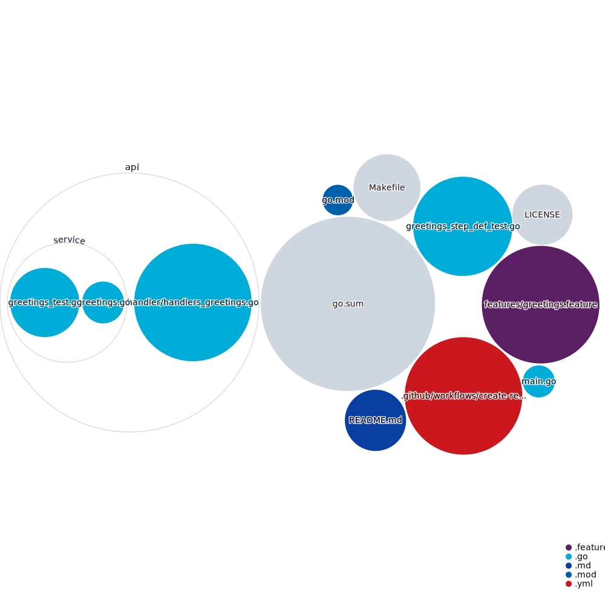

# golang-microservice-best-practices
This is a simple simple REST microservice with arguably best practices and integrations for golang.

The codebase can be visualized as below:



## Running the unit test

Execute below command from the root of this directory.
```bash
go test ./...
```
or
```bash
make test
```

## Running the mutation test

Execute below command from the root of this directory.
```bash
go-mutesting --test-recursive api/...
```
or
```bash
make mutation-test
```

## Start the app

Execute below command:

```bash
go run main.go
```
or
```bash
make start
```

Open the browser and make call to the url:

```bash
http://localhost:5000/greetings/greet/abhishek
```

You should receive a response with greeting based on the path argument passed after "/greet/" and time of the day.

Example:
```
Hi abhishek, Good Morning.
```

## Running the bdd test

Make sure the app is still running, we are used godog for writing the tests.

```bash
go get github.com/cucumber/godog/cmd/godog
```

Execute below command from the root of this directory.
```bash
godog run
```
or
```bash
make bdd-test
```